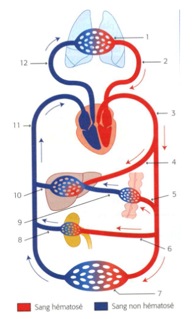
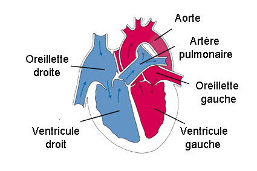
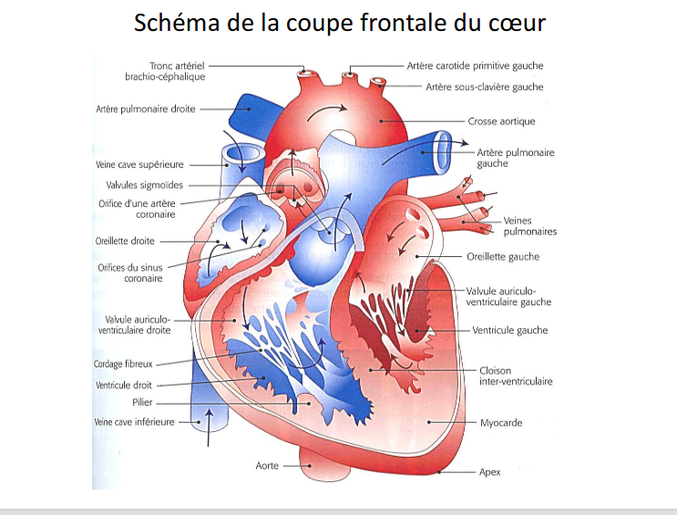
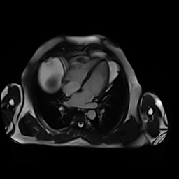
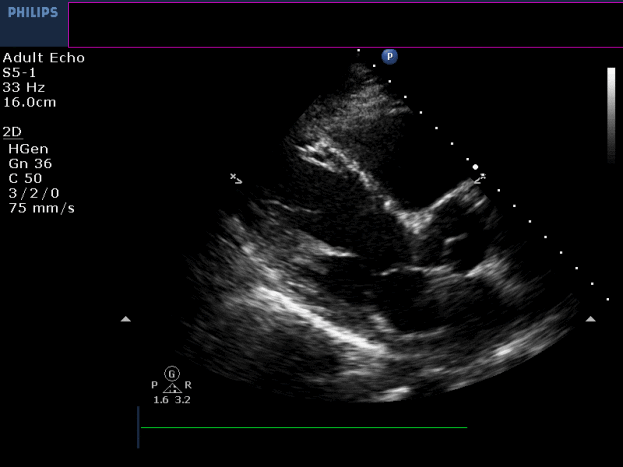
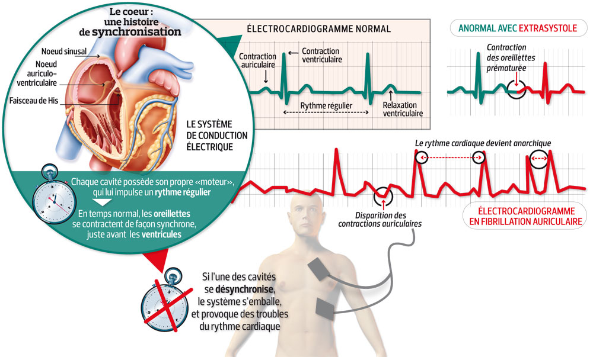
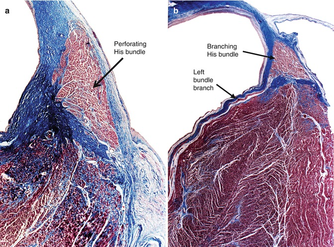
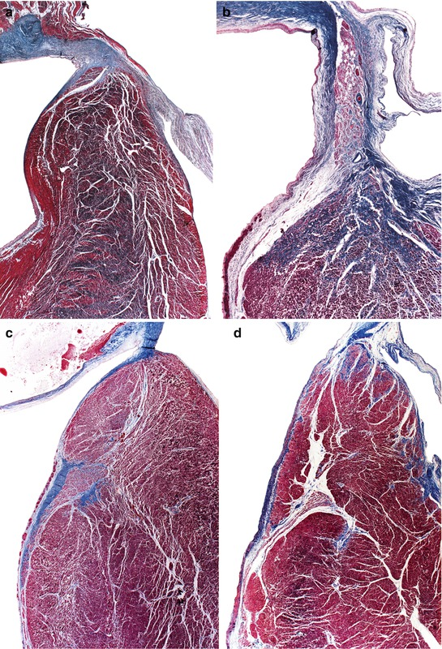
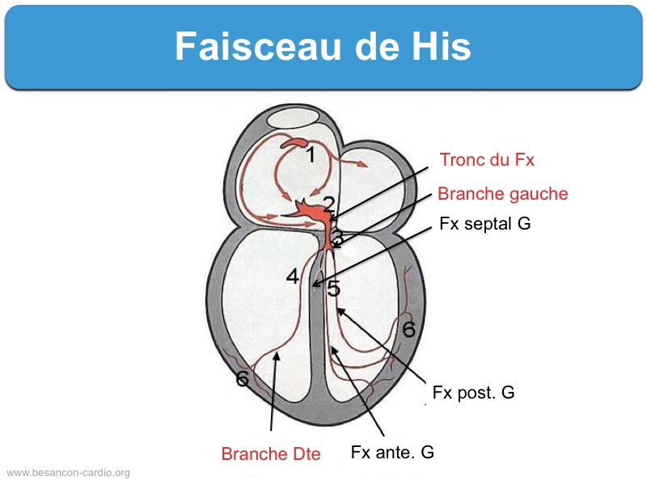

## Schéma anatomie

### Figure 1

### Figure 2

### Figure 3

[ref](http://www.lycee-sainte-cecile.com/sites/resources/files/Biologie-Physiopathologie/diaporama%20LE%20CUR%20ET%20LA%20CIRCULATION%20SANGUINE.pdf) cours-ENSEIRB

## Imagerie

### Visualisation des 4 cavitées par IRM (contraste bssfp)

[lien](https://cdn.ymaws.com/scmr.org/resource/resmgr/cow_images/2017/RV_Infarct_CMR_4_CH_SSFP.gif)

### Visualisation petit axe par IRM (contraste bssfp)

[lien](https://cdn.ymaws.com/scmr.org/resource/resmgr/cow_images/2017/RV_Infarct_CMR_SA_SSFP_2.gif)

### Visualisation des coronaires avec agent de contraste sous rayon X

[lien](https://cdn.ymaws.com/scmr.org/resource/resmgr/cow_images/2017/RV_Infarct_RCx_Angiogram_Ini.gif)

### Visualisation des valves sous échographie

[lien](https://scmr.org/resource/resmgr/cow_images/2017/RV_Infarct_Echo_PLAX.gif)

### Visualisation de l'activitation electrique
[lien](https://media.lactualite.com/2018/04/heart-beat-gif-source-1.gif)

## La rythmologie cardiaque en deux mots

Automaticité cardiaque

## Schéma His

## Imagerie du reseau de conduction

[ref](http://www.lycee-sainte-cecile.com/sites/resources/files/Biologie-Physiopathologie/diaporama%20LE%20CUR%20ET%20LA%20CIRCULATION%20SANGUINE.pdf)
